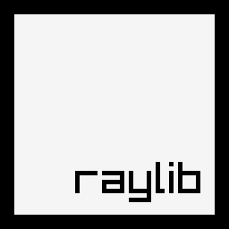
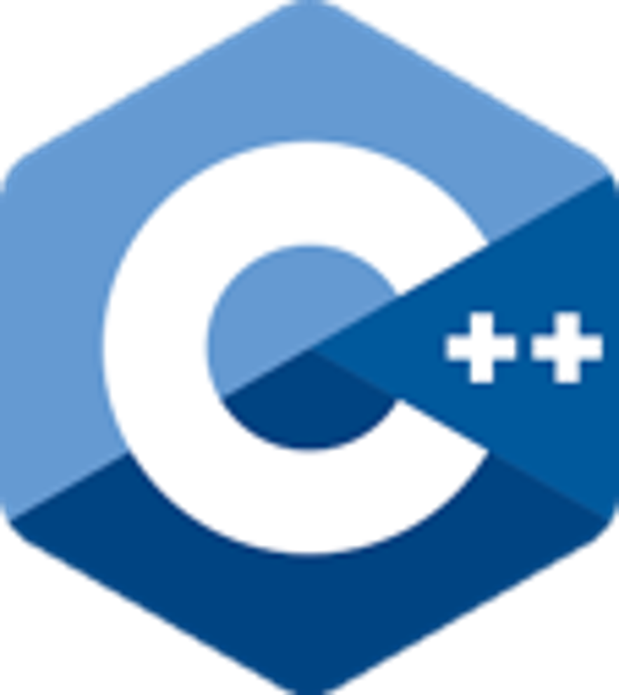

<h1 align="center"> TEAM 14 </h1>
<p align="center">
  
</p>


## 📌 Table of contents
- [About the Project](#about)
- [Documentation](#docs)
- [Installation & Setup](#install)
- [Tech Stack](#technologies)
- [Contributors](#team)

---

## 🔍 Description <a name="about"></a>
A lost boy must navigate a tangled forest maze to find his way back to his village. Players uncover hidden paths, avoid dead ends, and collect items that reveal story clues and help progress. The mission: outsmart the maze and escape the forest before it traps you for good.

---

## 📃 Documentation and  Presentation   <a name="docs"></a>
- 📜 [Documentation]()
- 🎤 [Presentation]()

---

## 🚀 Installation  and  Setup <a name="install"></a> 

1️⃣ **Clone our project:**
```sh
 git clone https://github.com/codingburgas/sprint-10th-grade-14.git
```
2️⃣ **Open VS2022 and run it from there.**  🖥️

---

## 💻Tech Stack <a name="technologies"></a>

###  Tools:
<p>
  
  
  
</p>

### Languages:
<p>
       
  
</p>

### Comunication: 


### Documentation: 
<p>
  
  
</p>

### Design: 

<p>
  
  
</p>

---
 ## 👥 Team <a name="team"></a>

| Name | Role | Grade |
| :---:   | :---: | :---: |
|  <h3><a href = "https://github.com/KBPozharliev23">Kaloyan Pozharliev</a></h3> | Scrum Trainer | 10G |
| <h3><a href = "https://github.com/KaloyanBoychev"> Kaloyan Boychev </a></h3>| Backend Developer | 10B |
| <h3><a href = "https://github.com/MNDiamarov23"> Martin Dimarov </a></h3> |  Frontend Developer  | 10V |
| <h3><a href = "https://github.com/ELTinchev23"> Emanuil Tinchev</a></h3> | Designer | 10A |

---
